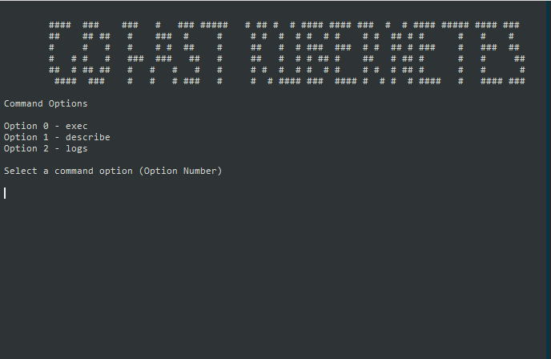

# goFastKubernetes
My tool for run fast options in kubernetes

<p align="center">
  <a href="https://github.com/fcastillovilches/goFastKubernetes/actions/runs/231883294"></a>
  

## Build

```bash
git clone https://github.com/fcastillovilches/goFastKubernetes.git
cd goFastKubernetes
go build gofastkubernetes.go
```

## Shell Script Global

```bash
sudo cp gofastkubernetes /usr/bin/
```

## Global Execute

```bash
gofastkubernetes
```

## Screenshot


